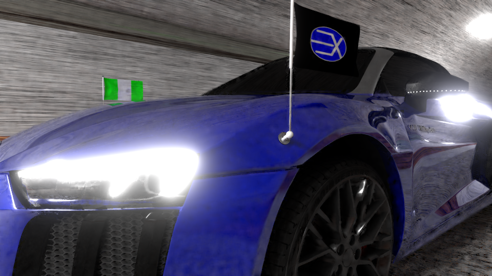

# Renders

This Repository specifies 3D rendered images we created at emexrevolarter using Blender 2.8, 2.9. It contains characters, automobiles, topographies, and abstracts.

Datoonie character was created in-house, and she is our official Toon. Using Marvelous Designer, fitting dresses are made for the characters. Others are: Doyin, Moyin, Nike, and Peppee.

Mood was re-created (texture and beacon light) in-house, posed, and also animated. We have host of other characters we re-create and animate as well.

Rigging and animation of Ambassador was done in-house. We do add needed assets to the automobile too, such as functional head lamps, flags, e.t.c.

Feel free to go through the items in the directories. We will be updating new ones too. You can always use the contact form on our website for feedback.

### See Other Repositories
[Animation 3D][1] | [Client Projects][3] | [Smart Store Android][4] | [Smart Store Desktop][5] | [Smart Store Web][6]

You may visit our [Official YouTube Channel][7] to view them in full. Yo can as well get the latest updates from our [Official Website][8].

Do not forget to subscribe to our YouTube Channel, like, and click on the notification button as well. Thank you.

  [1]: https://github.com/emexrevolarter/animation-3d
  [3]: https://github.com/emexrevolarter/client-projects
  [4]: https://github.com/emexrevolarter/smart-store-android
  [5]: https://github.com/emexrevolarter/smart-store-desktop
  [6]: https://github.com/emexrevolarter/smart-store-web
  [7]: https://www.youtube.com/channel/UCrzJoGKoUFAn4O57MPzhKDA
  [8]: https://emexrevolarter.com
